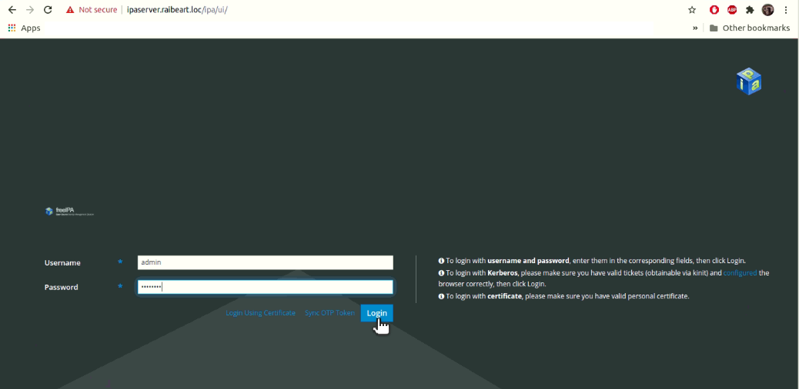
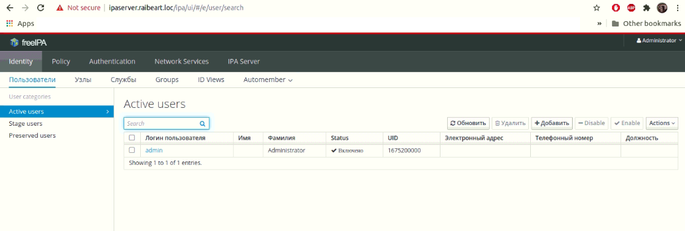
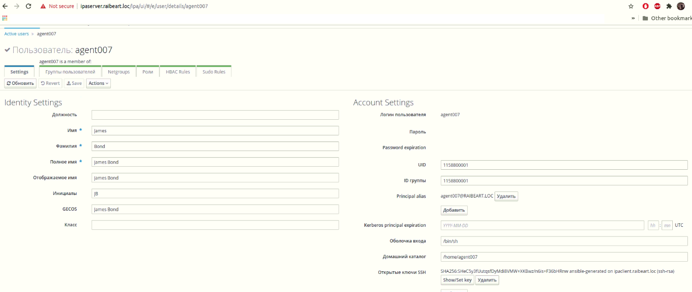

# Установка FreeIPA Server + Client с использованием ansible

Цели:
1. Установить FreeIPA Server;
2. Установить FreeIPA Client;
3. Firewall должен быть включен на сервере и на клиенте.
4. При развертывании внести данные о пользователе

# Решение

# Для проверки работы вам потребуется:
- Ansible 2.13.5 (дополнительно потребовалось поставить ansible-core)
- при отсутствии виртуалок, используем Oracle VirtualBox 7.0 и Vagrant 2.3.2

Если по команде vagrant up из основной директории проекта выдает ошибку образа, требуется скачать и установить образ, аналогичный Centos 7 -  https://app.vagrantup.com/centos/boxes/7
Также трубется заменить название образа, которое вы указали при загрузке (команда vagrant box add --name ИМЯ_ОБРАЗА URL or Address to Image) в файле Vagrantfile проекта.

      Vagrant.configure("2") do |config|
         config.vm.box = "ИМЯ_ОБРАЗА"

------------------------------------------------------------

Примечание. Сценарий развертывания FreeIPA на ansible довольно непредсказуемый. Плюсуем к этому требовательность к ресурсам и относительную неспешность. В среднем конфигурирование freeIPA приходилось ожидать около 3-5 минут. В случае проблем, к примеру, неправильной конфигурации - увеличивалось до 8 минут. Тут всё по спартански!

Запуск стенда:

            $ vagrant up

Будут разрешены порты для сервера:

                TCP Ports:
                  * 80, 443: HTTP/HTTPS
                  * 389, 636: LDAP/LDAPS
                  * 88, 464: kerberos
                UDP Ports:
                  * 88, 464: kerberos
                  * 123: ntp

Для сервера и клиента указываем временной пояс и ставим пакеты контроля за временем. Не забываем про firewall

На выходе 2 виртуальные машины: 
Server 192.168.56.10
Client 192.168.56.20

После отработки сценариев, откройте свой локальный хост /etc/hosts и добавьте строчку:

            192.168.56.10 ipaserver.raibeart.loc
            
Откройте браузер и перейдите по адресу:

            https://ipaserver.raibeart.loc

Испоьзуйте данные на вход как администратор: 

           admin
           ZZ12zz34

Мы успешно авторизовались:

Также мы видим, что наш клиентский сценарий отработал и у нас появилась еще одна запись

Проверка, что авторизация клиента идет по ключу:
Зайти на клиентскую машину:  

           $ vagrant ssh ipaclient

Повышаем привилегии:

           $ sudo -i

Переключимся на тестового пользователя: 

           $ su Agent007

Подключиться к серверу по ключу 

           $ ssh ipaserver.raibeart.loc -v

С дополнительной информацией видно, что авторизация осуществляется по сгенерированному ключу

